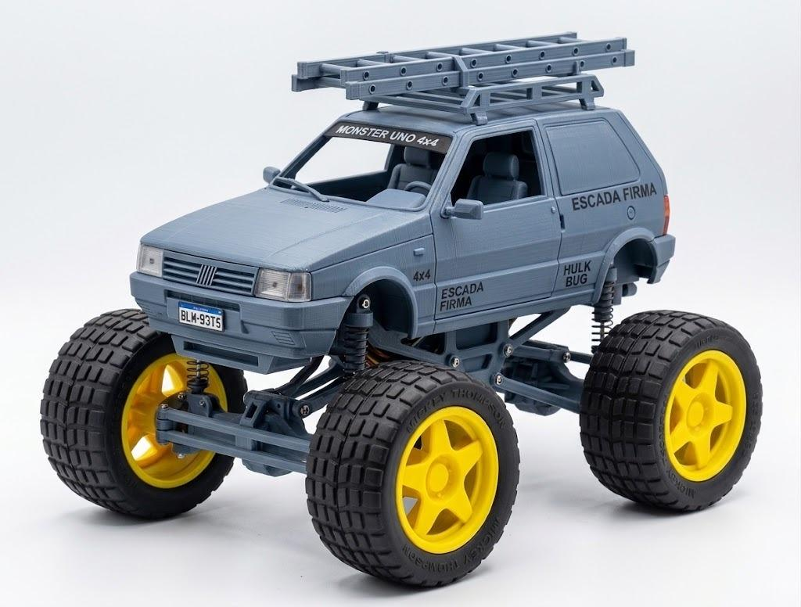
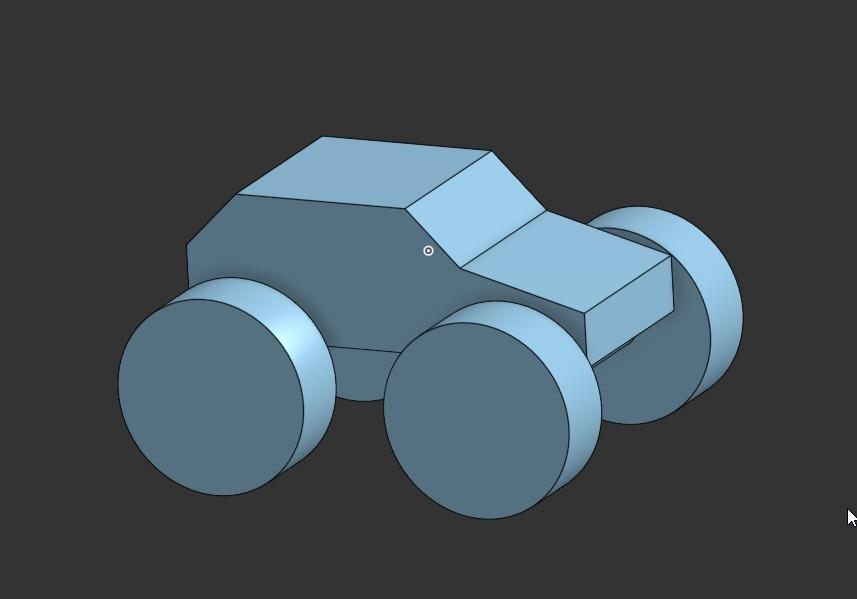
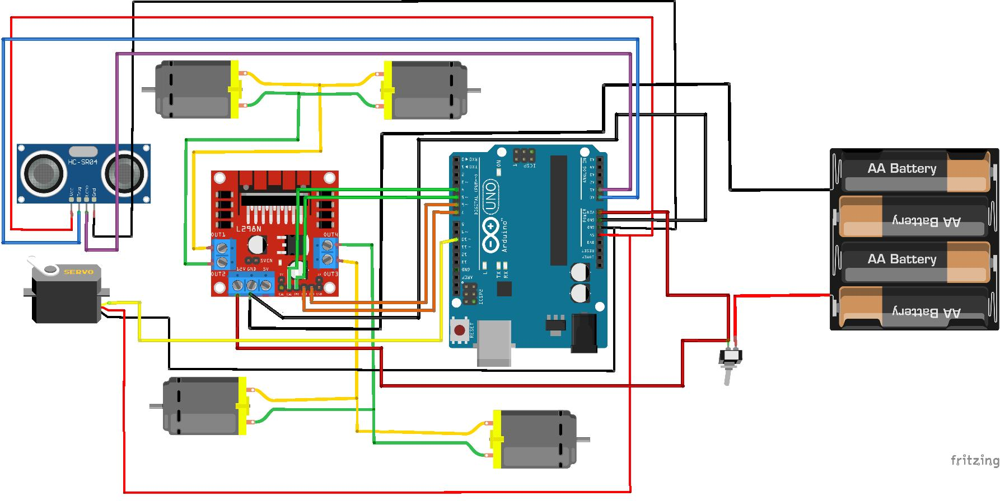

#  Carrinho Arduino

Projeto de construção e desenvolvimento de um carrinho robótico utilizando Arduino Uno, driver L298N, motores DC, sensor ultrassônico e módulo seguidor de linha.

O projeto está sendo desenvolvido de forma incremental, começando pela montagem mecânica e testes dos componentes, seguindo posteriormente para a programação e automação do carrinho.

##  Integrantes

| RM | Nome |
|:---:|---|
| 551117 | Lorenzo Gomes Andreata |
| 97158 | Lucas Moreno Matheus |
| 99756 | Kayky Oliveira Schunck |

##  Objetivos

O projeto tem como principais objetivos:

- [X] Montar a estrutura física do carrinho
- [ ] Controlar os quatro motores através do Arduino
- [ ] Implementar movimentos para frente e para trás
- [ ] Implementar curvas para esquerda e direita
- [ ] Detectar obstáculos com o sensor ultrassônico
- [ ] Implementar o modo seguidor de linha
- [ ] Integrar os sensores ao sistema de controle
- [ ] Desenvolver um carrinho parcialmente ou totalmente autônomo

##  Imagens
Conceito gerado com auxílio de IA

Mockup desenvolvido no CAD

## 📋 Componentes

O kit utilizado possui os seguintes componentes:

| Quantidade | Componente |
|:---:|---|
| 4 | Motores DC |
| 4 | Pneus |
| 4 | Suportes para motores |
| 2 | Chassis de acrílico |
| 1 | Driver L298N |
| 1 | Arduino Uno R3 (ATmega328P) |
| 1 | Placa/suporte para sensores |
| 1 | Kit de suporte |
| 1 | Engrenagem de direção |
| 1 | Sensor ultrassônico |
| 1 | Módulo seguidor de linha |
| 1 | Cabo USB |
| - | Parafusos e porcas |

## Arquitetura Eletrônica
- Baterias: 4x Pilhas AA
- Diagrama de https://saladeeletronica.blogspot.com/2022/10/carro-4wd-arduino.html:
  

## Tabela Dimensional

| Componente | Dimensões | Altura |
|---|:---:|:---:|
| Arduino Uno R3 | 68,6 mm x 53,4 mm | ~15 mm |
| Servo DC M2D3C11 | 70mm x 23mm | 37mm |
| Driver Motor Ponte H L298N | 43,0 mm x 43,0 mm | ~27,0 mm |
| Sensor Ultrassônico HC-SR04 | 45,0 mm x 20,0 mm | ~15,0 mm |

## Croqui Chassi

